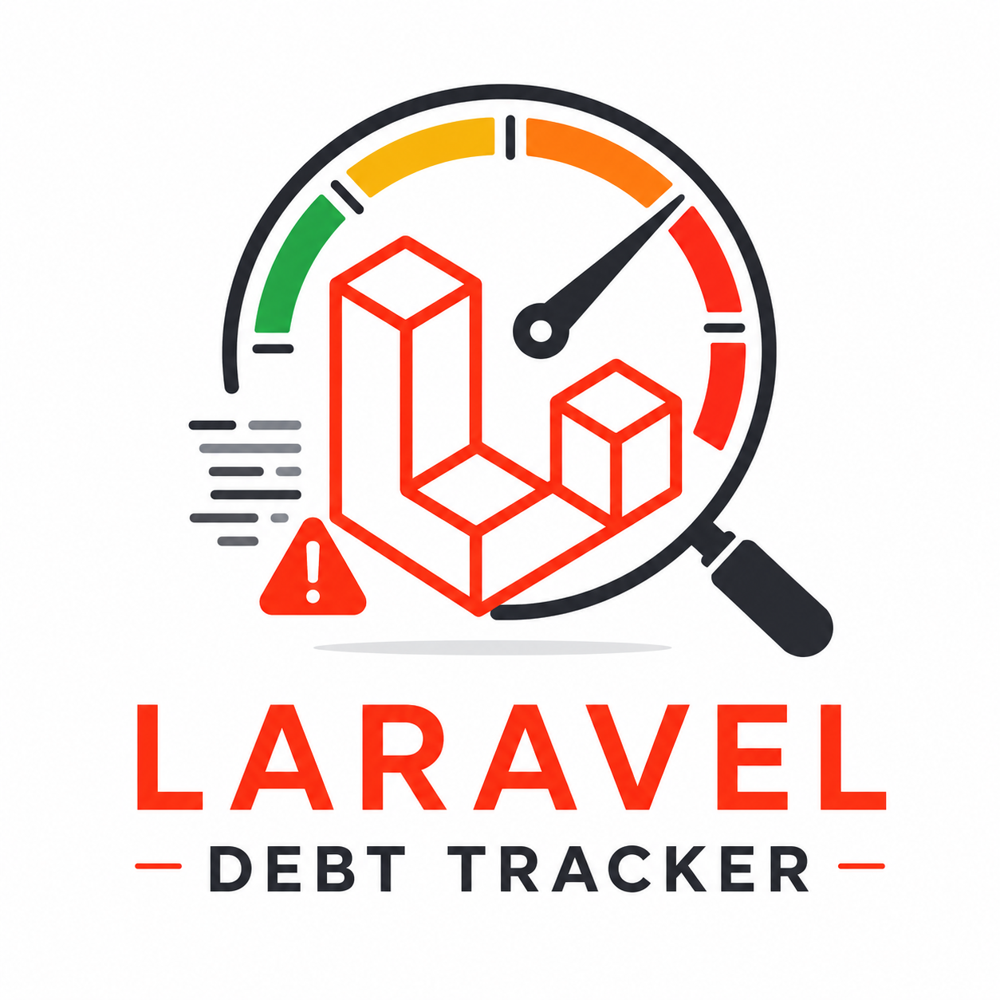

<p align="center">
  
</p>

<h1 align="center">Laravel Debt Tracker</h1>

<p align="center">
  <a href="https://techrayslabs.com">
    
  </a>
  &nbsp;
  <a href="https://packagist.org/packages/techrays-labs/laravel-debt-tracker">
    
  </a>
  &nbsp;
  <a href="https://packagist.org/packages/techrays-labs/laravel-debt-tracker">
    
  </a>
  &nbsp;
  
  &nbsp;
  
  &nbsp;
  <a href="https://github.com/techrays-labs/laravel-debt-tracker/blob/master/LICENSE">
    
  </a>
</p>

<p align="center">
  <strong>Scan, score, and report technical debt in your Laravel application — right from the CLI.</strong>
</p>

---

> **"We should fix this eventually"** — every engineering team, forever.
>
> Laravel Debt Tracker makes the invisible visible. It scans your codebase for technical debt across nine detectors, assigns a score, estimates developer hours to resolve, and produces a Markdown or JSON report you can actually show your product manager.

---

## Features

- **TODO / FIXME detection** — finds every deferred problem in your comments
- **Complexity analysis** — cyclomatic complexity, long methods, God classes, deep nesting
- **N+1 query detection** — flags Eloquent lazy-load patterns inside loops and collection iterators
- **Security smell detection** — flags eval/exec, hardcoded credentials, md5/sha1 on passwords, SQL concatenation, unsafe unserialize, and debug leakage
- **Dead code detection** — flags unused private methods, properties, and constants within classes
- **Test coverage heuristics** — no Xdebug required; detects untested classes and methods
- **Dependency audit** — flags outdated or abandoned Composer packages
- **Git blame enrichment** — older debt scores higher; age is the multiplier
- **Git author leaderboard** — surfaces who owns the most debt across terminal, Markdown, and JSON reports
- **Debt grading** — A through F, with estimated dev hours to resolve
- **Markdown & JSON export** — shareable reports with a shield badge for your README

---

## Requirements

| Requirement | Version |
|---|---|
| PHP | 8.2, 8.3, 8.4 |
| Laravel | 10, 11, 12, 13 |

---

## Installation

```bash
composer require --dev techrays-labs/laravel-debt-tracker
```

That's it. The package auto-discovers itself.

Optionally publish the config:

```bash
php artisan vendor:publish --tag=debt-tracker-config
```

---

## Usage

### Full scan

```bash
php artisan debt:scan
```

```
┌ Laravel Debt Tracker · by Techrays Labs ──────────────────┐

  Scanning files  ████████████████░░░░  249/312
  app/Services/LegacyPaymentService.php

  Project Grade: C    Total Score: 412    Est. Hours: 103h

  Debt by Category:
  ┌─────────────────────────┬───────┬──────────┐
  │ Category                │ Items │ Score    │
  ├─────────────────────────┼───────┼──────────┤
  │ TODOs / FIXMEs          │  ---  │  112     │
  │ Complexity              │  ---  │  180     │
  │ Missing Test Coverage   │  ---  │   88     │
  │ Outdated Dependencies   │  ---  │   32     │
  │ N+1 Queries             │  ---  │   24     │
  │ Security Smells         │  ---  │   18     │
  │ Dead Code               │  ---  │    6     │
  └─────────────────────────┴───────┴──────────┘

  Top 10 Worst Files:
  ┌────────────────────────────────────────┬───────┬───────┐
  │ File                                   │ Items │ Score │
  ├────────────────────────────────────────┼───────┼───────┤
  │ app/Services/LegacyPaymentService.php  │  14   │  98   │
  │ app/Http/Controllers/OrderController   │   9   │  72   │
  │ ...                                    │       │       │
  └────────────────────────────────────────┴───────┴───────┘

└ Scan complete · Grade: C · Score: 412 · 47 items found ───┘
```

### Export to Markdown

```bash
php artisan debt:scan --export=markdown
```

Writes `DEBT_REPORT.md` to your project root — ready to commit or share.

### Export to JSON

```bash
php artisan debt:scan --export=json
```

Writes `DEBT_REPORT.json` — machine-readable output for dashboards, scripts, or CI integrations.

### Export both at once

```bash
php artisan debt:scan --export=markdown,json
```

### CI-friendly summary

```bash
php artisan debt:summary
# [Techrays Debt Tracker] Grade: C | Score: 412 | Est: 103h | Files: 312
# Exit code: 1 (C), 0 (A/B), 2 (D/F) — gate your pipeline on debt grade
```

### Scan a specific path

```bash
php artisan debt:scan --path=app/Services
```

### Run specific detectors only

Every detector has a key you can pass to `--only`. Combine as many as you need with commas.

```bash
# TODOs, FIXMEs, HACKs, XXXs, TEMPs and REFACTORs in comments
php artisan debt:scan --only=todos

# Cyclomatic complexity, long methods, God classes, deep nesting
php artisan debt:scan --only=complexity

# Missing test files and untested public methods
php artisan debt:scan --only=coverage

# Outdated or abandoned Composer packages
php artisan debt:scan --only=dependencies

# Eloquent lazy-load (N+1) patterns inside loops and collection iterators
php artisan debt:scan --only=n1_queries

# Security smells: eval/exec, hardcoded credentials, weak hashing,
# SQL concatenation, unsafe unserialize, debug leakage (dd/dump)
php artisan debt:scan --only=security

# Dead code: unused private methods, properties and constants
php artisan debt:scan --only=dead_code

# Combine any detectors in a single run
php artisan debt:scan --only=security,dead_code
php artisan debt:scan --only=todos,complexity,n1_queries
php artisan debt:scan --only=todos,complexity,coverage,dependencies,n1_queries,security,dead_code
```

> **Note:** `--only` works at the detector level. For example, `--only=dead_code` reports unused private methods, properties, and constants together — there is no sub-filter within a detector.

### Inspect a single file or class

```bash
php artisan debt:show-file app/Services/PaymentService.php
php artisan debt:show-class "App\Services\PaymentService"
```

---

## Configuration

```php
// config/debt-tracker.php

return [
    'scan_paths' => ['app'],
    'exclude_paths' => ['app/Http/Middleware'],

    'thresholds' => [
        'method_length'        => 30,   // lines
        'class_length'         => 500,  // lines
        'max_public_methods'   => 20,
        'nesting_depth'        => 4,
        'complexity_per_method'=> 10,
    ],

    'cost' => [
        'hours_per_point' => 0.25,
        'hourly_rate'     => null, // set to show $ estimates
    ],

    'detectors' => [
        'todos'        => true,
        'complexity'   => true,
        'coverage'     => true,
        'dependencies' => true,
        'git_age'      => true,
        'n1_queries'   => true,
        'security'     => true,
        'dead_code'    => true,
    ],

    'n1_ignore_properties'     => ['id', 'uuid', 'created_at', 'updated_at', 'deleted_at'],
    'security_exclude_paths'   => ['tests', 'database/seeders'],
    'dead_code_ignore_methods' => [],

    'export' => [
        'path'      => base_path('DEBT_REPORT.md'),
        'json_path' => base_path('DEBT_REPORT.json'),
    ],
];
```

---

## How Scoring Works

Each detected debt item gets a **base score** multiplied by an **age multiplier**:

```
Item Score = Base Weight × Age Multiplier
```

| Debt Type | Base Score |
|---|---|
| TODO / FIXME | 2 |
| Long method | 5 |
| God class | 15 |
| Deep nesting | 4 |
| Untested class | 8 |
| Outdated major dep | 10 |
| Abandoned package | 20 |
| N+1 property fetch | 6 |
| N+1 chained query | 10 |
| Dangerous function call (eval/exec) | 20 |
| Unsafe unserialize | 20 |
| Hardcoded credential | 15 |
| SQL concatenation | 15 |
| Weak hashing (md5/sha1) | 10 |
| Debug leakage (dd/dump) | 5 |
| Unused private method | 8 |
| Unused private property | 5 |
| Unused private constant | 3 |

| Debt Age | Multiplier |
|---|---|
| < 30 days | 1.0× |
| 30–90 days | 1.5× |
| 90–180 days | 2.0× |
| 180+ days | 3.0× |

| Total Score | Grade |
|---|---|
| 0–100 | A — Healthy |
| 101–300 | B — Manageable |
| 301–600 | C — Concerning |
| 601–1000 | D — Critical |
| 1000+ | F — Emergency |

---

## Reports

### Markdown

The exported `DEBT_REPORT.md` includes a shields.io badge you can embed in your README:

```markdown

```

### JSON

`DEBT_REPORT.json` uses a stable schema suitable for CI dashboards or custom tooling:

```json
{
  "generated_at": "2026-06-09T19:49:00+00:00",
  "grade": "B",
  "total_score": 141,
  "estimated_hours": 35.3,
  "file_count": 18,
  "item_count": 21,
  "by_category": [...],
  "authors": [{"author": "Jane Doe", "debt_score": 87}, ...],
  "top_files": [...],
  "top_classes": [...],
  "items": [...],
  "meta": { "package": "techrays-labs/laravel-debt-tracker", "url": "..." }
}
```

---

## Contributing

Contributions are welcome!

- Read [CONTRIBUTING.md](CONTRIBUTING.md) for setup instructions, coding standards, and how to add a new detector
- Read [CODE_OF_CONDUCT.md](CODE_OF_CONDUCT.md) before participating in discussions or submitting contributions
- Report security vulnerabilities privately via [SECURITY.md](SECURITY.md) — do not open a public issue
- Use the [Bug Report](https://github.com/techrays-labs/laravel-debt-tracker/issues/new?template=bug_report.md) or [Feature Request](https://github.com/techrays-labs/laravel-debt-tracker/issues/new?template=feature_request.md) issue templates

```bash
git clone https://github.com/techrays-labs/laravel-debt-tracker
cd laravel-debt-tracker
composer install
php vendor/bin/testbench package:test
```

---

## License

MIT · © [Techrays Labs](https://techrayslabs.com)

---

<p align="center">
  Built with ❤️ by <a href="https://techrayslabs.com"><strong>Techrays Labs</strong></a> · Ahmedabad, India<br>
  <sub>We build software and the teams that build software.</sub>
</p>
