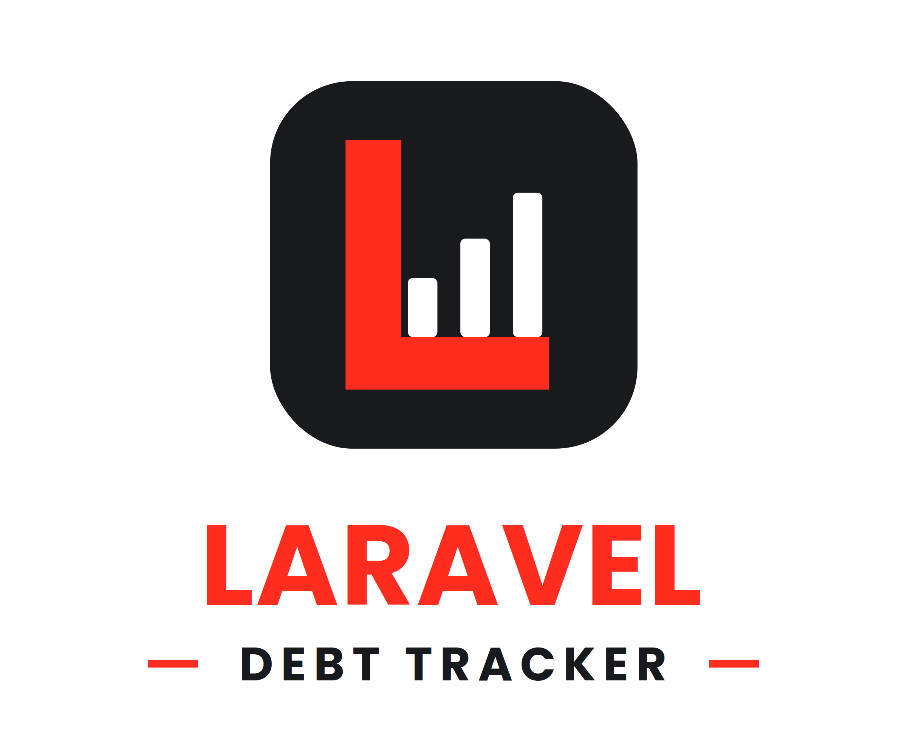

<p align="center">
  
</p>

<h1 align="center">Laravel Debt Tracker</h1>

<p align="center">
  <a href="https://techrayslabs.com">
    
  </a>
  &nbsp;
  <a href="https://packagist.org/packages/techrays-labs/laravel-debt-tracker">
    
  </a>
  &nbsp;
  <a href="https://packagist.org/packages/techrays-labs/laravel-debt-tracker">
    
  </a>
  &nbsp;
  
  &nbsp;
  
  &nbsp;
  <a href="https://laravel.com/docs/pulse">
    
  </a>
  &nbsp;
  <a href="#agent--mcp-integration">
    
  </a>
  &nbsp;
  <a href="https://github.com/techrays-labs/laravel-debt-tracker/blob/master/LICENSE">
    
  </a>
</p>

<p align="center">
  <strong>Scan, score, and report technical debt in your Laravel application — right from the CLI.</strong>
</p>

---

> **"We should fix this eventually"** — every engineering team, forever.
>
> Laravel Debt Tracker makes the invisible visible. It scans your codebase for technical debt across nine detectors, assigns a score, estimates developer hours to resolve, and produces a Markdown or JSON report you can actually show your product manager — and, as of v2.0.0, a JSON contract and local MCP server your AI coding agent can query directly.

---

## Features

- **Agent / MCP interface** — `--format=agent` JSON contract plus a local `debt:mcp-serve` MCP server, so AI coding agents query real debt data instead of grepping for it
- **TODO / FIXME detection** — finds every deferred problem in your comments
- **Complexity analysis** — cyclomatic complexity, long methods, God classes, deep nesting
- **N+1 query detection** — flags Eloquent lazy-load patterns inside loops and collection iterators
- **Security smell detection** — flags eval/exec, hardcoded credentials, md5/sha1 on passwords, SQL concatenation, unsafe unserialize, and debug leakage
- **Dead code detection** — flags unused private methods, properties, and constants within classes
- **Test coverage heuristics** — no Xdebug required; detects untested classes and methods
- **Dependency audit** — flags outdated or abandoned Composer packages
- **Git blame enrichment** — older debt scores higher; age is the multiplier
- **Git author leaderboard** — surfaces who owns the most debt across terminal, Markdown, and JSON reports
- **Laravel Pulse cards** — grade summary, score trend, hottest files, and author leaderboard visible in your Pulse dashboard with zero extra packages
- **Debt grading** — A through F, with estimated dev hours to resolve
- **Markdown & JSON export** — shareable reports with a shield badge for your README

---

## Agent / MCP Integration

AI coding agents (Claude Code, Cursor, GitHub Copilot, or any MCP-capable
client) can query real debt data from this package directly — the AST-aware
complexity analysis and git-blame age scoring you already get from
`debt:scan`, instead of an agent approximating the same signals with grep.

Two ways in, both new in v2.0.0 and fully opt-in:

### `--format=agent`

`debt:scan` and `debt:summary` accept `--format=agent`, which prints a single
versioned JSON document to stdout instead of the terminal report — no
progress bar, no tables, nothing else mixed into stdout:

```bash
php artisan debt:scan --format=agent --limit=5
```

```json
{
  "schema_version": "1.0",
  "grade": "B",
  "total_score": 342,
  "estimated_hours": 85.5,
  "file_count": 128,
  "item_count": 47,
  "items": [
    {
      "type": "complexity",
      "file": "/absolute/path/to/app/Services/PaymentService.php",
      "line_range": { "start": 88, "end": 88 },
      "class_name": "PaymentService",
      "method_name": "process",
      "final_score": 18,
      "age_band": "chronic",
      "age_days": 142,
      "summary": "This complexity issue in PaymentService::process() has been chronic for 142 days and carries a score of 18."
    }
  ],
  "priority": [ /* same shape as "items", top-scored, capped by --limit (default 10) */ ],
  "meta": { "package": "techrays-labs/laravel-debt-tracker", "version": "2.0.0", "generated_at": "2026-09-18T10:00:00+00:00" }
}
```

`--format=agent` on `debt:summary` returns the identical schema — one
contract, whichever command you call it from. A zero-item scan still returns
the full schema with empty `items`/`priority` arrays; an internal failure
returns `{"error": {"code", "message"}}` and nothing else on stdout. Gate
flags (`--fail-on-grade`, `--max-score`) still apply and still control the
exit code (`0`/`1`); only a bad flag value or an internal error changes the
payload to the error shape (exit `2`/`3`).

This JSON contract is versioned (`schema_version`) and tested independently
of `--export=json` — evolving one never silently changes the other.

### `debt:mcp-serve`

Starts a local MCP server over stdio, exposing four read-only tools backed by
the exact same scan/gate logic as the CLI:

| Tool | Same as |
|------|---------|
| `debt_scan` | `debt:scan --format=agent` (`path`, `only`, `limit` params) |
| `debt_show_file` | `debt:show-file` |
| `debt_show_class` | `debt:show-class` |
| `debt_gate_check` | the CI Debt Gate (`failOnGrade`, `maxScore` params) |

```bash
php artisan debt:mcp-serve
```

Requires the `mcp/sdk` package, which is **not** installed by a plain
`composer require --dev techrays-labs/laravel-debt-tracker` — same
suggest-only pattern as the optional Laravel Pulse integration:

```bash
composer require --dev mcp/sdk
```

Running `debt:mcp-serve` without it prints a clear error instead of
fataling.

#### Claude Code

```bash
claude mcp add --transport stdio debt-tracker -- php artisan debt:mcp-serve
```

#### Cursor

Add to `.cursor/mcp.json`:

```json
{
  "mcpServers": {
    "debt-tracker": {
      "command": "php",
      "args": ["artisan", "debt:mcp-serve"]
    }
  }
}
```

#### Generic MCP client

```json
{
  "mcpServers": {
    "debt-tracker": {
      "command": "php",
      "args": ["artisan", "debt:mcp-serve"],
      "cwd": "/path/to/your/laravel/app"
    }
  }
}
```

#### Worked example

```
Agent → calls debt_scan {"limit": 3}
Server → { "grade": "B", "total_score": 342, "priority": [
             { "file": "app/Services/PaymentService.php", "method_name": "process",
               "final_score": 18, "summary": "This complexity issue in PaymentService::process() has been chronic for 142 days and carries a score of 18." },
             ...
           ], ... }
Agent → reads priority[0], calls debt_show_file {"path": "app/Services/PaymentService.php"}
Server → the full item list for that file, same agent-format shape
Agent → proposes a refactor of PaymentService::process() to the developer, citing the score and age
```

#### Threat model (MCP-5)

The server is **read-only by design**: no tool accepts a shell command, a
file path outside the scanned project root, or performs a file write.
Exactly four tools are exposed — nothing else — enforced by an integration
test against the real protocol, not just documentation. Auto-fixing or
code-writing is explicitly out of scope for this interface; if you want an
agent to apply fixes, that's a separate concern from diagnostics.

---

## Requirements

| Requirement | Version |
|---|---|
| PHP | 8.2, 8.3, 8.4 |
| Laravel | 10, 11, 12, 13 |

---

> **Support policy:** Only the current release (`v1.3.x`) receives bug fixes, security patches, and updates. All versions below v1.3 have reached end of life. If you are on v1.0, v1.1, or v1.2 please upgrade — see [CHANGELOG.md](CHANGELOG.md) for what changed.

---

## Installation

```bash
composer require --dev techrays-labs/laravel-debt-tracker
```

That's it. The package auto-discovers itself.

Optionally publish the config:

```bash
php artisan vendor:publish --tag=debt-tracker-config
```

---

## Usage

### Full scan

```bash
php artisan debt:scan
```

```
┌ Laravel Debt Tracker · by Techrays Labs ──────────────────┐

  Scanning files  ████████████████░░░░  249/312
  app/Services/LegacyPaymentService.php

  Project Grade: C    Total Score: 412    Est. Hours: 103h

  Debt by Category:
  ┌─────────────────────────┬───────┬──────────┐
  │ Category                │ Items │ Score    │
  ├─────────────────────────┼───────┼──────────┤
  │ TODOs / FIXMEs          │  ---  │  112     │
  │ Complexity              │  ---  │  180     │
  │ Missing Test Coverage   │  ---  │   88     │
  │ Outdated Dependencies   │  ---  │   32     │
  │ N+1 Queries             │  ---  │   24     │
  │ Security Smells         │  ---  │   18     │
  │ Dead Code               │  ---  │    6     │
  └─────────────────────────┴───────┴──────────┘

  Top 10 Worst Files:
  ┌────────────────────────────────────────┬───────┬───────┐
  │ File                                   │ Items │ Score │
  ├────────────────────────────────────────┼───────┼───────┤
  │ app/Services/LegacyPaymentService.php  │  14   │  98   │
  │ app/Http/Controllers/OrderController   │   9   │  72   │
  │ ...                                    │       │       │
  └────────────────────────────────────────┴───────┴───────┘

└ Scan complete · Grade: C · Score: 412 · 47 items found ───┘
```

### Export to Markdown

```bash
php artisan debt:scan --export=markdown
```

Writes `DEBT_REPORT.md` to your project root — ready to commit or share.

### Export to JSON

```bash
php artisan debt:scan --export=json
```

Writes `DEBT_REPORT.json` — machine-readable output for dashboards, scripts, or CI integrations.

### Export both at once

```bash
php artisan debt:scan --export=markdown,json
```

### CI-friendly summary

```bash
php artisan debt:summary
# [Techrays Debt Tracker] Grade: C | Score: 412 | Est: 103h | Files: 312
# Exit code: 1 (C), 0 (A/B), 2 (D/F) — gate your pipeline on debt grade
```

### Scan a specific path

```bash
php artisan debt:scan --path=app/Services
```

### Run specific detectors only

Every detector has a key you can pass to `--only`. Combine as many as you need with commas.

```bash
# TODOs, FIXMEs, HACKs, XXXs, TEMPs and REFACTORs in comments
php artisan debt:scan --only=todos

# Cyclomatic complexity, long methods, God classes, deep nesting
php artisan debt:scan --only=complexity

# Missing test files and untested public methods
php artisan debt:scan --only=coverage

# Outdated or abandoned Composer packages
php artisan debt:scan --only=dependencies

# Eloquent lazy-load (N+1) patterns inside loops and collection iterators
php artisan debt:scan --only=n1_queries

# Security smells: eval/exec, hardcoded credentials, weak hashing,
# SQL concatenation, unsafe unserialize, debug leakage (dd/dump)
php artisan debt:scan --only=security

# Dead code: unused private methods, properties and constants
php artisan debt:scan --only=dead_code

# Combine any detectors in a single run
php artisan debt:scan --only=security,dead_code
php artisan debt:scan --only=todos,complexity,n1_queries
php artisan debt:scan --only=todos,complexity,coverage,dependencies,n1_queries,security,dead_code
```

> **Note:** `--only` works at the detector level. For example, `--only=dead_code` reports unused private methods, properties, and constants together — there is no sub-filter within a detector.

### Inspect a single file or class

```bash
php artisan debt:show-file app/Services/PaymentService.php
php artisan debt:show-class "App\Services\PaymentService"
```

---

## CI Debt Gate

Block a pull request when technical debt crosses a line you set. Both `debt:scan`
and `debt:summary` accept two opt-in flags:

| Flag | Fails (exit 1) when |
|------|---------------------|
| `--fail-on-grade=C` | the grade is `C` or worse (`C`, `D`, `F`) |
| `--max-score=500` | the total debt score is greater than `500` |

If both are set, the gate fails when **either** threshold is breached.

**Exit codes:** `0` = passed (or gate not configured), `1` = a threshold was
breached, `2` = invalid flag value (bad grade letter or non-numeric score).

### Set the policy once in config

Instead of repeating flags in every workflow, set defaults in
`config/debt-tracker.php` — a CLI flag always overrides the config value:

```php
'ci' => [
    'fail_on_grade' => 'C',
    'max_score'     => 500,
],
```

### GitHub Actions

```yaml
- name: Technical debt gate
  run: php artisan debt:scan --fail-on-grade=C
```

> **Note on `debt:summary`:** without any gate flag or `ci` config, `debt:summary`
> keeps its historical exit codes (`0` for A/B, `1` for C, `2` for D/F). Passing a
> gate flag (or setting the `ci` config) switches it to the gate's `0`/`1` scheme.

---

## Configuration

```php
// config/debt-tracker.php

return [
    'scan_paths' => ['app'],
    'exclude_paths' => ['app/Http/Middleware'],

    'thresholds' => [
        'method_length'        => 30,   // lines
        'class_length'         => 500,  // lines
        'max_public_methods'   => 20,
        'nesting_depth'        => 4,
        'complexity_per_method'=> 10,
    ],

    'cost' => [
        'hours_per_point' => 0.25,
        'hourly_rate'     => null, // set to show $ estimates
    ],

    'detectors' => [
        'todos'        => true,
        'complexity'   => true,
        'coverage'     => true,
        'dependencies' => true,
        'git_age'      => true,
        'n1_queries'   => true,
        'security'     => true,
        'dead_code'    => true,
    ],

    'n1_ignore_properties'     => ['id', 'uuid', 'created_at', 'updated_at', 'deleted_at'],
    'security_exclude_paths'   => ['tests', 'database/seeders'],
    'dead_code_ignore_methods' => [],

    'export' => [
        'path'      => base_path('DEBT_REPORT.md'),
        'json_path' => base_path('DEBT_REPORT.json'),
    ],
];
```

---

## Laravel Pulse Integration

Laravel Debt Tracker ships with four built-in Pulse dashboard cards. No extra package needed — the cards activate automatically when `laravel/pulse` and `livewire/livewire` are present in your app.

> **Requirements**
> - `laravel/pulse ^1.0` — tested with v1.0 through v1.7
> - `livewire/livewire ^3.0` — pulled in automatically as a dependency of Pulse
> - **MySQL 8 or MariaDB** — MySQL 9 is not currently supported due to a bug in Pulse's `DatabaseStorage` where `key_hash` is omitted from INSERTs on MySQL 9, causing a strict-mode constraint failure. Track progress at [laravel/pulse#476](https://github.com/laravel/pulse/issues/476) (or check the Pulse changelog for a fix).
>
> Neither package is a hard dependency of `laravel-debt-tracker`. Install them in your app and the integration activates on its own.

| Card | Component tag | What it shows |
|---|---|---|
| **Debt Summary** | `<livewire:debt-tracker-summary-card>` | Current grade (A–F), total score, estimated hours, category breakdown |
| **Score Over Time** | `<livewire:debt-tracker-score-card>` | Debt score trend chart — see when PRs made things worse |
| **Hottest Files** | `<livewire:debt-tracker-files-card>` | Top 10 files by debt score, updated every scan |
| **Top Debt Authors** | `<livewire:debt-tracker-authors-card>` | Top 10 authors by total debt score via git blame |

### Setup

**1. Publish the card views** (optional — only needed to customise them):

```bash
php artisan vendor:publish --tag=debt-tracker-pulse-views
```

**2. Add the cards to your Pulse dashboard** in `resources/views/vendor/pulse/dashboard.blade.php`:

```blade
<livewire:debt-tracker-summary-card cols="2" />
<livewire:debt-tracker-score-card cols="4" />
<livewire:debt-tracker-files-card cols="3" />
<livewire:debt-tracker-authors-card cols="3" />
```

> The `cols` values above fill a standard 12-column Pulse grid row. Adjust to your layout.

**3. Populate the cards** — run a scan:

```bash
php artisan debt:scan
```

Cards update automatically every time `debt:scan` runs.

### Scheduled scans

To keep your dashboard up to date automatically, schedule `debt:scan` in `routes/console.php`:

```php
use Illuminate\Support\Facades\Schedule;

Schedule::command('debt:scan')->daily();
```

### Disabling Pulse push

To run ad-hoc scans without updating the dashboard, set in `config/debt-tracker.php`:

```php
'pulse' => [
    'enabled' => false,
],
```

---

## How Scoring Works

Each detected debt item gets a **base score** multiplied by an **age multiplier**:

```
Item Score = Base Weight × Age Multiplier
```

| Debt Type | Base Score |
|---|---|
| TODO / FIXME | 2 |
| Long method | 5 |
| God class | 15 |
| Deep nesting | 4 |
| Untested class | 8 |
| Outdated major dep | 10 |
| Abandoned package | 20 |
| N+1 property fetch | 6 |
| N+1 chained query | 10 |
| Dangerous function call (eval/exec) | 20 |
| Unsafe unserialize | 20 |
| Hardcoded credential | 15 |
| SQL concatenation | 15 |
| Weak hashing (md5/sha1) | 10 |
| Debug leakage (dd/dump) | 5 |
| Unused private method | 8 |
| Unused private property | 5 |
| Unused private constant | 3 |

| Debt Age | Multiplier |
|---|---|
| < 30 days | 1.0× |
| 30–90 days | 1.5× |
| 90–180 days | 2.0× |
| 180+ days | 3.0× |

| Total Score | Grade |
|---|---|
| 0–100 | A — Healthy |
| 101–300 | B — Manageable |
| 301–600 | C — Concerning |
| 601–1000 | D — Critical |
| 1000+ | F — Emergency |

---

## Reports

### Markdown

The exported `DEBT_REPORT.md` includes a shields.io badge you can embed in your README:

```markdown

```

### JSON

`DEBT_REPORT.json` uses a stable schema suitable for CI dashboards or custom tooling:

```json
{
  "generated_at": "2026-06-09T19:49:00+00:00",
  "grade": "B",
  "total_score": 141,
  "estimated_hours": 35.3,
  "file_count": 18,
  "item_count": 21,
  "by_category": [...],
  "authors": [{"author": "Jane Doe", "debt_score": 87}, ...],
  "top_files": [...],
  "top_classes": [...],
  "items": [...],
  "meta": { "package": "techrays-labs/laravel-debt-tracker", "url": "..." }
}
```

---

## Contributing

Contributions are welcome!

- Read [CONTRIBUTING.md](CONTRIBUTING.md) for setup instructions, coding standards, and how to add a new detector
- Read [CODE_OF_CONDUCT.md](CODE_OF_CONDUCT.md) before participating in discussions or submitting contributions
- Report security vulnerabilities privately via [SECURITY.md](SECURITY.md) — do not open a public issue
- Use the [Bug Report](https://github.com/techrays-labs/laravel-debt-tracker/issues/new?template=bug_report.md) or [Feature Request](https://github.com/techrays-labs/laravel-debt-tracker/issues/new?template=feature_request.md) issue templates

```bash
git clone https://github.com/techrays-labs/laravel-debt-tracker
cd laravel-debt-tracker
composer install
php vendor/bin/testbench package:test
```

---

## License

MIT · © [Techrays Labs](https://techrayslabs.com)

---

<p align="center">
  Built with ❤️ by <a href="https://techrayslabs.com"><strong>Techrays Labs</strong></a> · Ahmedabad, India<br>
  <sub>We build software and the teams that build software.</sub>
</p>
